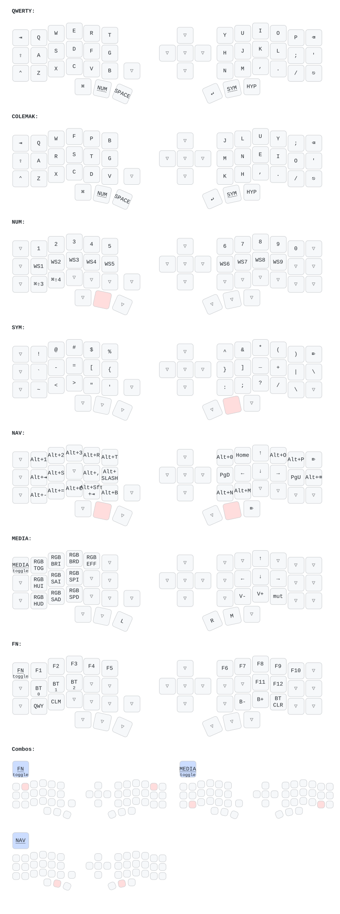

# My `eyelash_corne` keymap - [Aliexpress](https://www.aliexpress.us/item/3256808273876596.html?spm=a2g0o.order_list.order_list_main.15.7a271802RMqUdF&gatewayAdapt=glo2usa)

---

# Objectives: 
+ To migrate to colemak dh but also maintain muscle memory on my current workflow, optimized for:
    - [x] Neovim
    - [x] Tmux
    - [x] Aerospace
    - [x] Touch typing
    - [x] MacOS & Linux (suck it Microslop)
+ To increase efficiency in my typing and reduce the key-travel time.
+ To cook up more AI slop with the new colemak dh typing @140 WPM.


## Specs & Features| Spec | Detail |

|------|--------|
| Keyboard | Eyelash Corne (AliExpress) |
| Controller | nice!nano (nRF52840) |
| Firmware | ZMK v0.3.0 |
| Keys | 42 (3×6 + 3 thumbs per side) |
| Connectivity | Bluetooth 5.0 / USB-C |
 
 
## Layer Overview
 
| # | Name | Access | Purpose |
|---|------|--------|---------|
| 0 | QWERTY | Default | Base typing layer |
| 1 | COLEMAK | FN layer toggle | Colemak-DH alpha swap |
| 2 | NUM | Hold left mid thumb | Numbers + AeroSpace workspaces |
| 3 | SYM | Hold left outer thumb | All symbols and brackets |
| 4 | NAV | Hold right mid thumb | Vim-style navigation |
| 5 | TMUX | `E+I` combo toggle | Pre-prefixed tmux bindings |
| 6 | MEDIA | `Z+/` combo toggle | RGB, volume, mouse |
| 7 | FN | `Q+P` combo toggle | Function keys, Bluetooth, system |


## Thumb Cluster
 
```
Left:  [ LCTRL ]  [ NUM/RET ]  [ SYM/SPC ]
Right: [ NAV/TAB ]  [ RET ]  [ HYPER ]
```
 
| Key | Tap | Hold |
|-----|-----|------|
| Left outer | `Ctrl` | `Ctrl` |
| Left mid | `Return` | NUM layer |
| Left mid2 | `Space` | SYM layer |
| Right mid | `Tab` | NAV layer |
| Right mid2 | `Return` | — |
| Right outer | `Hyper` | `Hyper` |
 
 
## Combos
 
| Combo | Keys | Action | Notes |
|-------|------|--------|-------|
| FN layer | `Q + P` | Toggle FN | Top row outer corners — deliberate |
| TMUX layer | `E + I` | Toggle TMUX | Top row symmetric — deliberate |
| MEDIA layer | `Z + /` | Toggle MEDIA | Bottom row outer corners — deliberate |
 
All combos have a 50ms timeout to prevent misfires during normal typing.

---

# Mappings and Layers

